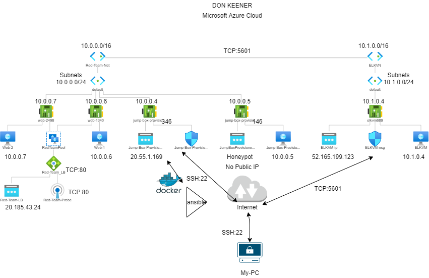
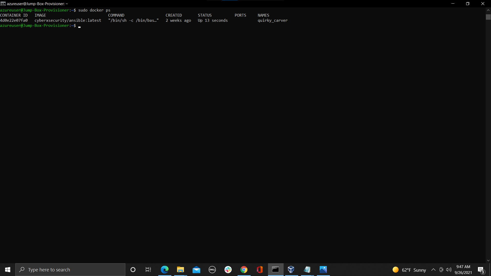

## Automated ELK Stack Deployment

The files in this repository were used to configure the network depicted below.

These files have been tested and used to generate a live ELK deployment on Azure. They can be used to either recreate the entire deployment pictured above. Alternatively, select portions of the __ansible___ file may be used to install only certain pieces of it, such as Filebeat.
elk-playbook.yml
  - filebeat-playbook.yml 
  - metricbeat-playbook.yml
This document contains the following details:
- Description of the Topologu
- Access Policies
- ELK Configuration
  - Beats in Use
  - Machines Being Monitored
- How to Use the Ansible Build

### Description of the Topology

The main purpose of this network is to expose a load-balanced and monitored instance of DVWA, the D*mn Vulnerable Web Application.

Load balancing ensures that the application will be highly __accessible___, in addition to restricting ___traffic__ to the network.
- What aspect of security do load balancers protect? What is the advantage of a jump box?_ load balancers protect the servers from DDos attacks. The advantage of a jump box is its the only gateway to access the infrastructure, reducing the attack surface. 

Integrating an ELK server allows users to easily monitor the vulnerable VMs for changes to the __data___ and system ___logs__.
- _ What does Filebeat watch for?_log files or locations that you specify.
- _ What does Metricbeat record?_metrics and statistics and services running.

The configuration details of each machine may be found below.
_Note: Use the [Markdown Table Generator](http://www.tablesgenerator.com/markdown_tables) to add/remove values from the table_.

| Name     | Function | IP Address | Operating System |
|----------|----------|------------|------------------|
| Jump Box | Gateway  | 10.0.0.1   | Linux            |
| VM 1     | Server   | 10.0.0.6   | Linux            |
| VM 2     | Server   | 10.0.0.7   | Linux 
  VM 3       Server     10.0.0.5     Linux
| ELK      | Monitor  | 10.0.0.4   | Linux            |

### Access Policies

The machines on the internal network are not exposed to the public Internet. 

Only the _Jump Box____ machine can accept connections from the Internet. Access to this machine is only allowed from the following IP addresses:
- My Public IP

Machines within the network can only be accessed by __via the Jump Box___.
-  Which machine did you allow to access your ELK VM? What was its IP address?_
Jump Box 10.0.0.1
A summary of the access policies in place can be found in the table below.

| Name     | Publicly Accessible | Allowed IP Addresses |
|----------|---------------------|----------------------|
| Jump Box | Yes                 | My Public IP         |
|          |                     |                      |
|          |                     |                      |

### Elk Configuration

Ansible was used to automate configuration of the ELK machine. No configuration was performed manually, which is advantageous because...
- What is the main advantage of automating configuration with Ansible?_ Speed is the main advantage of automating configuration with Ansible.

The playbook implements the following tasks:
- Install docker i.o
- Install python3-pip
- Install docker module
- Use more memory
- download and launch a docker elk container

The following screenshot displays the result of running `docker ps` after successfully configuring the ELK instance.

### Target Machines & Beats
This ELK server is configured to monitor the following machines:
-List the IP addresses of the machines you are monitoring_ 10.0.0.5 10.0.0.6 10.0.0.7

We have installed the following Beats on these machines:
- filebeat and metricbeat

These Beats allow us to collect the following information from each machine:
- In 1-2 sentences, explain what kind of data each beat collects, and provide 1 example of what you expect to see. E.g., `Winlogbeat` collects Windows logs, which we use to track user logon events, etc._

### Using the Playbook
In order to use the playbook, you will need to have an Ansible control node already configured. Assuming you have such a control node provisioned: 

SSH into the control node and follow the steps below:
- Copy the ___filebeat-config.yml and metricbeat-config.yml__ file to __/etc/ansible/files___.
- Update the _configuration ____ file to include...Private IP of the Elk-Server to the ElasticSearch and Kibana Sections of the Configuration File.
- Run the playbook, and navigate to _ELK-Server-PublicIP:5601___ to check that the installation worked as expected.

_ Answer the following questions to fill in the blanks:_
- _Which file is the playbook? Where do you copy it?_ elk-playbook.yml /etc/ansible/
- _Which file do you update to make Ansible run the playbook on a specific machine? /etc/ansible/hosst.config How do I specify which machine to install the ELK server on versus which to install Filebeat on?_ In the /etc/ansible/hosts file, you put in where you want each one to be installed, elkservers or filebeat.
- _Which URL do you navigate to in order to check that the ELK server is running?
http://publicip(elkserver):5601
_As a **Bonus**, provide the specific commands the user will need to run to download the playbook, update the files, etc._
ssh azureuser@JumpBox(PublicIP)
sudo docker container list -a - Locate the ansible container
sudo docker start (quirky_carver)
sudo docker attach (quirky_carver)
cd /etc/ansible
ansible-playbook elk-playbook.yml (Installs and Configures ELK-Server)
cd /etc/ansible/
ansible-playbook beats-playbook.yml (Installs and Configures Beats)
Open a new browser on Personal Workstation, navigate to (ELK-Server-PublicIP:5601/app/kibana) - This will bring up Kibana Web Portal
